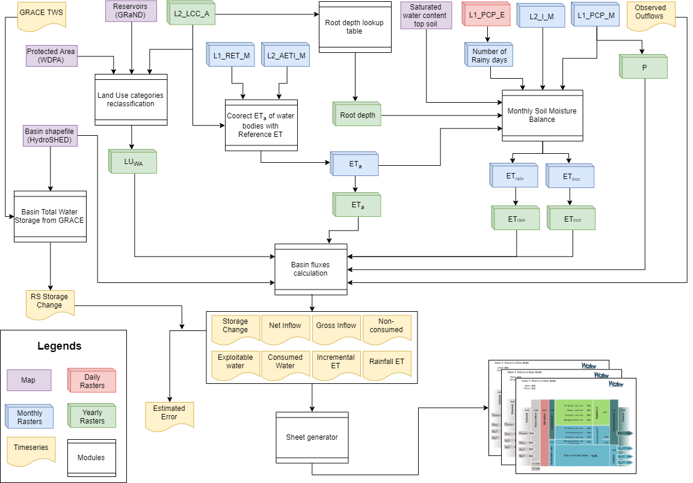

# WaPOR-based Water Accounting 

Authors: 
- Bich Tran (b.tran@un-ihe.org)
- Solomon Seyoum (s.seyoum@un-ihe.org)

With contributions from:

- Marloes Mul
- Quan Pan 
- Claire Michailovsky 
- Bert Coever 
- Elga Salvadore 
- Tim Hessels

## 1. About

This repository contains ipython notebooks, python scripts for the rapid Water Accounting analysis using WaPOR data in 5 river basins: Litani, Jordan, Awash, Niger, Nile. This work is done by the Water Accounting group at IHE-DELFT Institute for Water Education as a part of the WaPOR programme of The Food and Agriculture Organization of the United Nations (FAO).

http://www.fao.org/in-action/remote-sensing-for-water-productivity/overview/about-the-programme/en/

### 1.2. About WaPOR

Link: https://wapor.apps.fao.org/

FAO's web portal to monitor Water Productivity through Open-access of Remotely sensed derived data (WaPOR). This portal covers Africa and the Near East, with remotely sensed data, to monitor, in near real time, agricultural water and land productivity as well carbon dioxide uptake by vegetation.

For information about the programme, please visit: http://www.fao.org/in-action/remote-sensing-for-water-productivity/en/

### 1.3. About Water Accounting

Link: https://www.wateraccounting.org/

Water accounting is the process of communicating water resources related information and the services generated from consumptive use in a geographical domain, such as a river basin, a country or a land use class; to users such as policy makers, water authorities, managers, etc.

For more recent softwares developed by Water Accounting group at IHE-DELFT Institute for Water Education, please visit: https://github.com/wateraccounting

## 2. Description

### 2.1. Python requirements

### 2.2. Modules

#### 2.2.1. Workflow

**Example notebooks**:

- Litani:

#### 2.2.2. Pre-processing modules

- Landuse categories reclassification
- Rootdepth map

#### 2.2.3. Monthly Pixel-based Soil Moisture Balance model

#### 2.2.4. Basin fluxes calculation

### 2.3. Inputs

#### 2.3.1. WaPOR data

#### 2.3.2. Other data

#### 2.3.3. Test dataset

### 2.4. Outputs

#### 2.4.1. Water Accounting Sheet 1: Resource Base

#### 2.4.2. WaPOR-based Water Accounting Landuse Categories map 

#### 2.4.3. Water Accounting maps and charts
